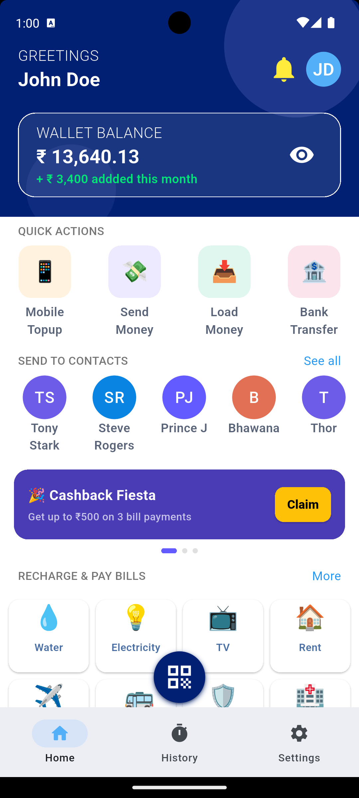
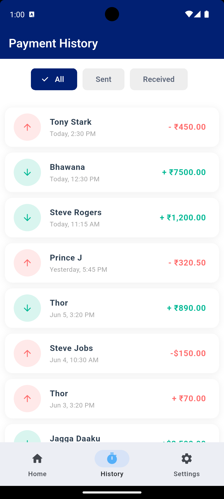
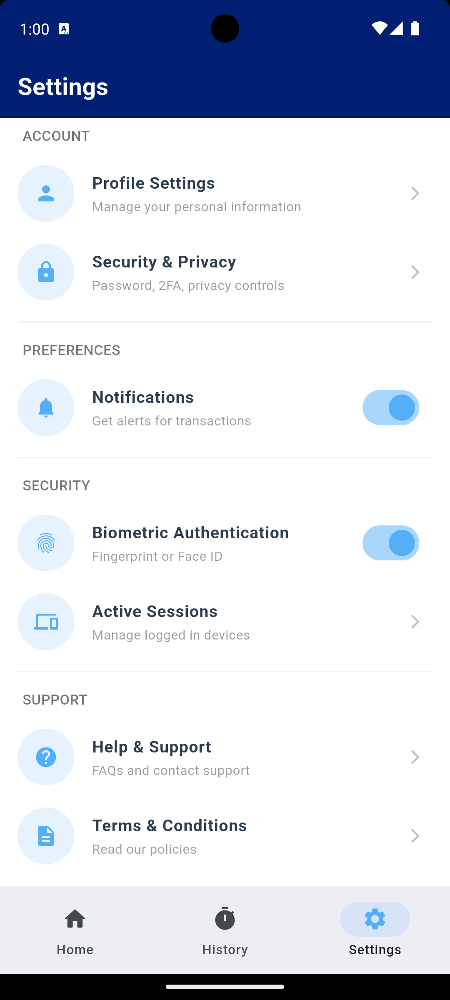
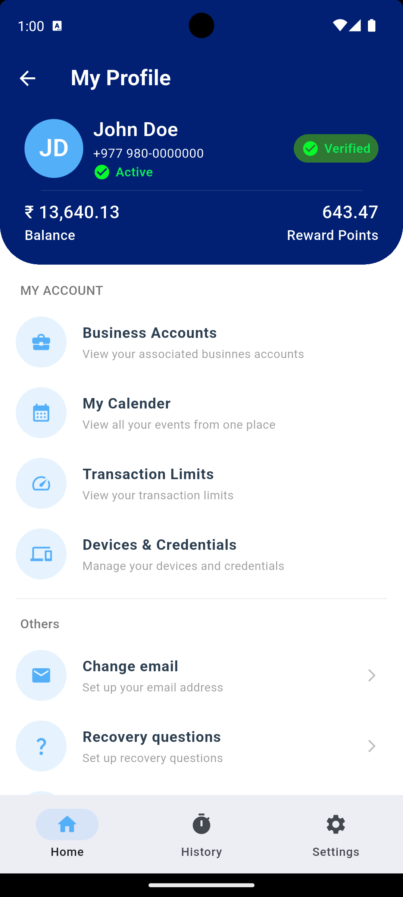

# Flutter Payment App UI

A Flutter UI application showcasing a modern payment app interface. This is a frontend-only project featuring mock data and custom constants—no backend integration.

## Features

- **Home Screen** - Account overview with balance display
- **Payment History** - Transaction history view
- **Quick Actions** - Fast access to common payment operations
- **Contact Management** - User contacts for payments
- **Offer Banners** - Promotional offers display
- **User Profile** - Profile management and settings
- **Bill Categories** - Organized bill payment options

## Project Structure

- `lib/screens/` - UI pages (home, payment history, settings, etc.)
- `lib/widgets/` - Reusable UI components
- `lib/models/` - Data models
- `lib/constants/` - App-wide constants and configuration
- `lib/data/` - Mock/dummy data

## Getting Started

1. **Install Flutter** - [Flutter Installation Guide](https://docs.flutter.dev/get-started/install)
2. **Get dependencies** - `flutter pub get`
3. **Run the app** - `flutter run`

## Screenshots

  
  
  
  

## Notes

This is a UI prototype with hardcoded dummy data. It demonstrates UI/UX design patterns and Flutter best practices without backend functionality.
